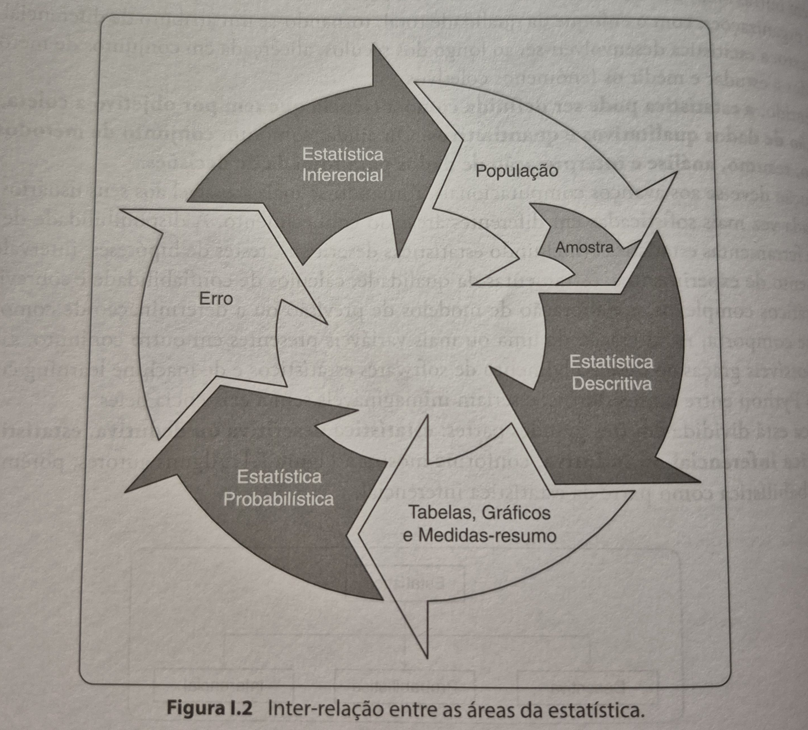

# Estatística
Aqui vou colocar conteúdo resumidos de livros e aprendizado de estatística para engenheiro de dados e engenheiro de IA.

# Teoria da Probabilidade
- [PT Language](https://pt.wikipedia.org/wiki/Teoria_das_probabilidades)

 Ciclo de Estatística pelo Livro - Manual de Análise de Dados

- População : Contém todos os indivíduos onde apresentam uma ou mais características em comum.
- Amostra: Representativo do grupo da população 
- Censo: Estudos dos dados de elementos da população
- Variável: Característica da população/amostra em estudo. Obter algum tipo de conclusão
- Dados: matéria prima
- Parâmetros:  Medidas estatísticas numéricas na qual precisam ser estimadas

 
